<div align="center">

# 🏎️ PorscheLab

### Enterprise-Grade Real-Time 3D Car Configurator — Powered by WebGL, React Three Fiber & GSAP

[](https://react.dev)
[](https://threejs.org)
[](https://typescriptlang.org)
[](https://vitejs.dev)
[](https://zustand-demo.pmnd.rs)
[](https://greensock.com/gsap)
[](https://netlify.com)
[](#)
[](#)
[](#)

</div>

---

<div align="center">


<br/>


<br/><br/>

**🏆 Lighthouse Score: 100 · Performance · Accessibility · Best Practices · SEO**

</div>

---

## 🏆 Recognition &amp; Achievements

<div align="center">

| 🏅 Achievement | 📌 Detail |
|:---:|:---:|
| 🔥 **Officially Reposted by Three.js** | Featured directly by the official **Three.js** account — recognized by the core WebGL community as a standout real-world implementation |
| 👍 **190+ Likes on LinkedIn** | Organically reached 190+ reactions on LinkedIn, driving significant professional engagement across the web & 3D development community |

</div>

> *Being officially featured by Three.js — the foundational library powering this entire project — is a rare honor that validates the depth of the WebGL engineering involved. The LinkedIn reception confirms real-world interest from both technical and business audiences.*

---

## 🚀 What is PorscheLab?

**PorscheLab** is a **photorealistic, browser-native 3D car configurator** that brings dealership-grade automotive visualization directly into any web browser — no app download, no plugins, no compromise.

Built entirely by hand with **0% AI-generated code**, every line of this codebase reflects intentional engineering decisions — from handcrafted 6-DOF camera keyframe arrays per vehicle, to a 13-channel audio engine that responds to every user interaction in real time.

> **Business Value:** In an era where automotive brands compete fiercely for customer attention online, PorscheLab demonstrates what a next-generation digital showroom looks like — immersive, interactive, and accessible from any device at **60–120 FPS**, including mobile.

---

## � Business Interaction Concept

PorscheLab is more than a technical showcase. It represents a **digital-first sales and engagement model** for the premium automotive industry:

| Business Use Case | How PorscheLab Enables It |
|---|---|
| 🏪 **Virtual Dealership** | Customers explore any model, any angle, any color — without stepping into a showroom |
| 🎨 **Real-Time Personalization** | Live paint, metalness & roughness controls let buyers configure their dream car instantly |
| 📱 **Omnichannel Reach** | Full mobile support means the configurator works on any device, anywhere |
| 🌍 **Environment Storytelling** | 8 cinematic HDRI environments let brands present cars in aspirational contexts |
| 🔊 **Sensory Brand Experience** | Spatial audio tied to every interaction (door, engine, spray) reinforces emotional connection |
| 🏠 **Interior Deep-Dive** | Buyers can step inside any car, switch seats, and inspect the cockpit — virtually |
| 📊 **Model Comparison** | Switch between 7 distinct Porsche lineups in seconds with seamless cinematic transitions |
| 🔗 **Embedded Spec Sheet** | Right-panel iframe links directly to official Porsche product pages per model |

---

## ⚡ Key Highlights

```
┌─────────────────────────────────────────────────────────────┐
│   🤖  AI-Generated Code          →   0%   (fully handcrafted) │
│   🎮  Rendering Performance      →   60–120+ FPS             │
│   📱  Mobile Support             →   100% (touch, pinch, UI) │
│   🏎️  Porsche Models Included    →   7 photorealistic models  │
│   🎨  Color Configurations       →   16 presets + custom hex  │
│   🌅  HDRI Environments          →   8 cinematic scenes       │
│   🔊  Audio Channels             →   13 spatially-aware sounds│
│   🏆  Lighthouse Score           →   100 across all metrics   │
└─────────────────────────────────────────────────────────────┘
```

---

## 🖼️ Visual Showcase

### 🎬 The Experience — First Look & Performance

The moment a user lands on PorscheLab, they're greeted with a **cinematic loading sequence** followed by a **scroll-driven brand narrative** — immersing them into Porsche's history before they ever touch the configurator.

PorscheLab is also engineered to perform at the highest standard — achieving **100/100 across all Lighthouse metrics** (Performance · Accessibility · Best Practices · SEO), proving that stunning 3D experiences and web performance are not mutually exclusive.

> *See the cover images above for the full-screen brand experience and UX/UI overview.*

---

### � Exterior Inspection — 360° Full Control

Users aren't passive observers. PorscheLab hands total physical control of the camera — drag to orbit, pinch to zoom, tap the inspect icon to jump to pre-choreographed cinematic viewpoints. Every angle, every detail.


> *The user can freely orbit around the vehicle in full 3D. The color picker panel is open at the bottom — 16 curated Porsche paint colors + custom hex input with live PBR paint update.*

---

### 🎨 Real-Time Paint — Applied

One click on a color swatch triggers a **GSAP-animated smooth color transition** directly on the car's PBR material in the WebGL scene — no page reload, no delay. The spray-shake sound fires simultaneously for full sensory feedback.


> *New paint color applied in real time. Metalness and roughness sliders allow further surface customization — from matte to mirror-chrome — all bound to per-car Zustand state.*

---

### 🔙 Rear Perspective — True 3D Depth

Because every model is a fully realized 3D asset with complete geometry on all sides, users can navigate to the rear of the vehicle — demonstrating that this is genuine spatial content, not a billboard or turntable illusion.


> *Rear-view perspective accessed via the Exterior Inspect cycling button. Each of the 8 keyframe positions is hand-calibrated per model for the most flattering camera angle.*

---

### 🏠 Interior Mode — Cockpit Immersion

A single tap on the steering wheel icon triggers the **door-close sound effect**, locks the camera into interior mode, and begins a guided cockpit tour. The camera constraints change entirely — close-range, restricted orbit, designed to feel like you're sitting in the seat.


> *Interior inspection mode active. Camera constraints shift to micro-range (minDistance: 0.05) to simulate being seated inside the vehicle. Interior ambient audio plays automatically.*

---

### 🌅 Environment Switcher — 8 Cinematic Scenes

The environment panel gives users access to **8 real-world HDRI captures** streamed live from Polyhaven at resolution-optimized quality (2K on mobile, 4K on desktop). The environment changes the entire lighting of the scene — affecting reflections, shadows, and mood.


> *Environment panel open showing all 8 HDRI options with thumbnail previews. Each environment has individually tuned ground projection parameters for interior vs. exterior views.*

---

### 📋 Model Detail Panel — Specs at a Glance

The left hamburger menu reveals a **model information panel** displaying the car's real-world specifications — 0-100 km/h time, top speed, power output (kW + PS), and price. A direct link to the official Porsche product page is embedded as an iframe.


> *Model detail drawer open. Specs pulled from the Zustand `porscheModelList` store. The iframe at the bottom loads the live Porsche Thailand product page for the current model.*

---

### 🪑 Interior — Rear Seat Zone

Interior mode isn't limited to the driver's seat. Users can cycle through **up to 5 interior camera positions** per vehicle — including rear passenger seats — for a full cabin inspection experience.


> *Rear cabin perspective. The interior inspect mode cycles through 5 hand-placed camera keyframes, each giving a distinct spatial understanding of the vehicle's interior layout.*


> *Same interior inspection applied to a different Porsche model — demonstrating that every vehicle in the lineup has independently configured interior camera paths.*

---

### 🔄 Car Model Switcher

The change-car panel displays all available Porsche models with thumbnail previews. Selecting a model triggers a **lazy-load swap** — the old model unmounts, the new GLTF component is code-split imported and rendered, with camera position restored to the hero exterior view.


> *Model selection panel showing all 7 Porsche models. Each entry displays real performance data. Switching models is seamless — Zustand state resets all inspect modes automatically.*

---

### �️ The Full Lineup — All 7 Models

PorscheLab covers Porsche's complete current-era lineup — from EV to hypercar. Every model has been manually optimized with calibrated PBR material parameters to look photorealistic under any HDRI environment.


> *All 7 models share the same camera system, audio engine, and UI — but each has independently calibrated metalness/roughness values, camera keyframe sets, and interior configurations.*

---

### 📱 Mobile — Full Performance, Zero Compromise

Every interaction — touch-to-orbit, pinch-to-zoom, tap-to-inspect, color swatches, spec panels — works identically on mobile. HDRI resolution auto-scales to 2K on smaller viewports. FPS stays at **60–120** even on mid-range phones.


> *Mobile screenshot composite showing smooth real-time rendering on phone screens. Touch controls mirror desktop interactions. The responsive layout adapts camera FOV (65° on mobile vs 50° on desktop) for optimal framing.*

---

## 📋 Table of Contents

1. [Technical Project Overview](#-technical-project-overview)
2. [Technology Architecture](#-technology-architecture)
3. [System Architecture Diagram](#-system-architecture-diagram)
4. [Rendering Pipeline](#-rendering-pipeline)
5. [Scene Initialization Sequence](#-scene-initialization-sequence)
6. [State Management Architecture](#-state-management-architecture)
7. [Camera Control System](#-camera-control-system)
8. [Audio Engine Architecture](#-audio-engine-architecture)
9. [3D Model Pipeline](#-3d-model-pipeline)
10. [Homepage Scroll Animation System](#-homepage-scroll-animation-system)
11. [Configurator UI Layer](#-configurator-ui-layer)
12. [HDR Environment System](#-hdr-environment-system)
13. [Deployment Pipeline](#-deployment-pipeline)
14. [Project Structure](#-project-structure)
15. [Getting Started](#-getting-started)
16. [Performance Considerations](#-performance-considerations)

---

## � Technical Project Overview

**PorscheLab** tackles several notoriously difficult engineering challenges simultaneously:

| Challenge | Solution |
|---|---|
| High-polygon GLTF models (multiple) in browser | Lazy-loaded `Suspense` with per-car code splitting |
| Physically-based rendering at 60fps | Tuned PBR material params + low-res post-process passes |
| Cinematic camera fly-throughs without jank | GSAP timeline-driven `CameraControls` choreography |
| Seamless exterior ↔ interior camera transitions | Per-model 3D LookAt keyframe configs stored in Zustand |
| Immersive spatial audio that mirrors scene state | Pre-loaded 13-track Web Audio engine with state gating |
| Scroll-driven homepage narrative with pinned sections | GSAP `ScrollTrigger` + `SplitText` word-by-word reveals |
| Real-time PBR paint override with metalness/roughness | Per-car `MeshStandardMaterial` binding through Zustand |
| HDR environment switching (8 environments) | Dynamic `.hdr` streaming from Polyhaven CDN |

---

## 🌐 Live Demo

> Deployed on **Netlify** with SPA redirect rules and Node 24 build environment.

```
https://your-deployment.netlify.app
```

---

## 🏗️ Technology Architecture

```
┌─────────────────────────────────────────────────────────────────────┐
│                        PorscheLab Stack                             │
├──────────────────┬──────────────────────────────────────────────────┤
│  Presentation    │  React 19 + TypeScript 5.8 + React Router 7      │
│  3D Engine       │  Three.js r176 + React Three Fiber 9             │
│  3D Utilities    │  @react-three/drei (CameraControls, Environment, │
│                  │  AccumulativeShadows, useProgress)               │
│  Post-Processing │  @react-three/postprocessing + postprocessing    │
│                  │  (Bloom, Vignette, BlendFunction)                │
│  Animation       │  GSAP 3 + @gsap/react + ScrollTrigger + SplitText│
│                  │  + TextPlugin                                    │
│  State           │  Zustand 5 (3 independent stores)               │
│  Audio           │  Web Audio API (HTMLAudioElement, 13 tracks)     │
│  3D Assets       │  GLTF/GLB (gltfjsx-generated React components)   │
│  Build           │  Vite 6 (ESM, code-splitting, lazy imports)      │
│  Deploy          │  Netlify (Node 24, SPA redirects)               │
└──────────────────┴──────────────────────────────────────────────────┘
```

---

## 🗺️ System Architecture Diagram

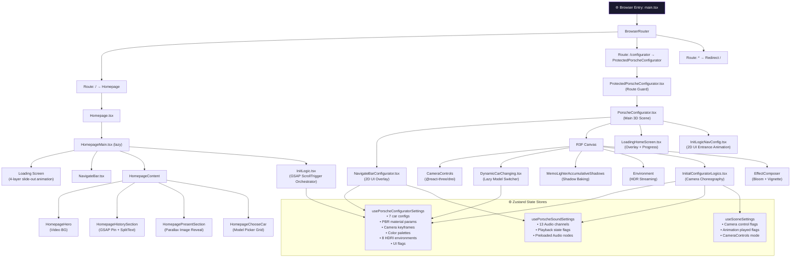

---

## 🎬 Rendering Pipeline

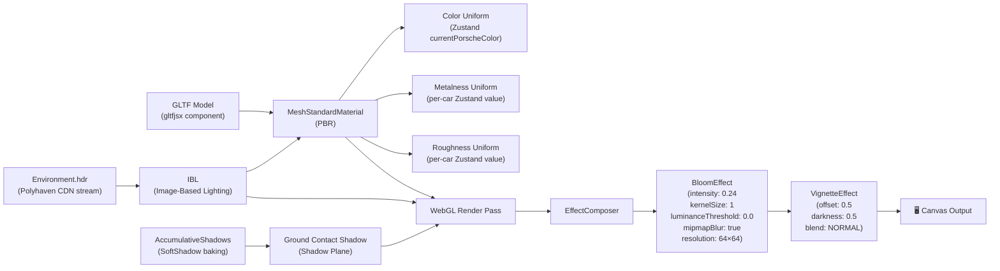

---

## ⚡ Scene Initialization Sequence

This is the most critical orchestration in the entire application. The configurator scene boots in **4 strict sequential phases** to prevent race conditions between asset loading, shadow baking, and camera choreography:

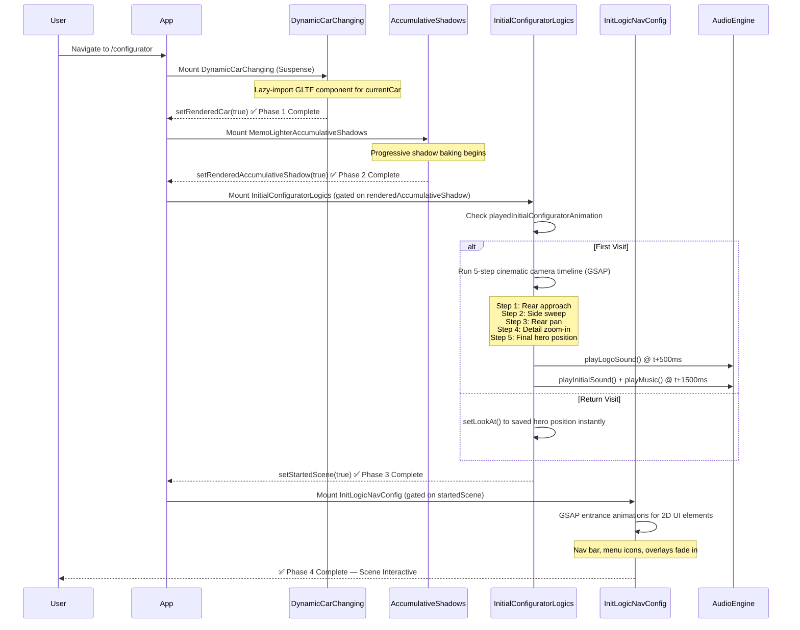

---

## 🗄️ State Management Architecture

Three specialized **Zustand** stores isolate concerns with zero cross-store coupling:

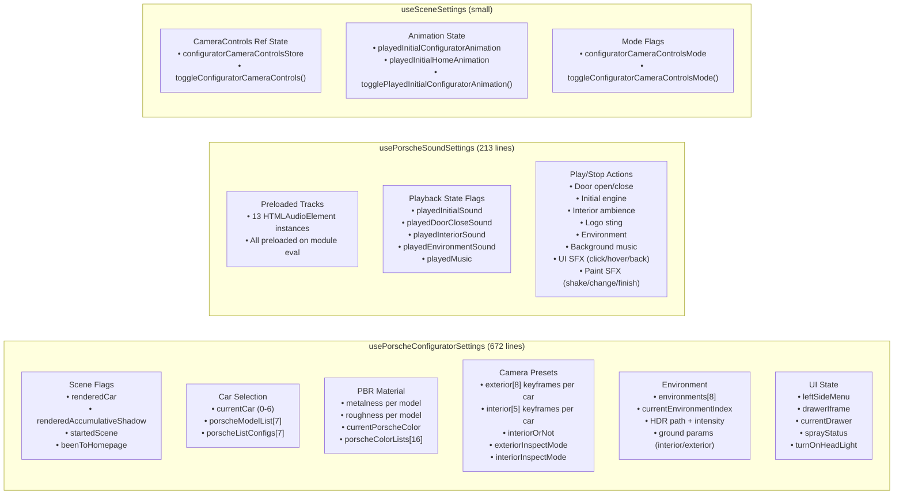

---

## 🎥 Camera Control System

The camera system is one of the most intricate parts of PorscheLab. It uses `@react-three/drei`'s `CameraControls` with **handcrafted 6-DOF keyframe arrays** stored per model.

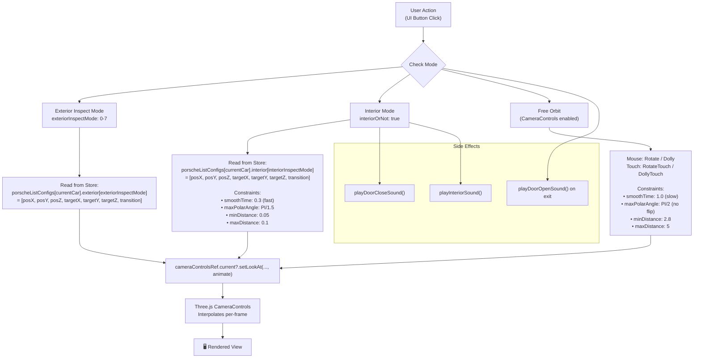

---

## 🔊 Audio Engine Architecture

```mermaid
graph TD
    INIT["Module Evaluation\n(usePorscheSoundSettings.tsx)"]

    INIT --> T1["soundDoorClose\nporsche_door_close.mp3\nvol: 0.2"]
    INIT --> T2["soundDoorOpen\nporsche_door_open.mp3\nvol: 0.2"]
    INIT --> T3["soundPorscheConfigStart\nporsche_configurator_start.mp3\nvol: 0.2"]
    INIT --> T4["soundPorscheConfigInterior\nporsche_configurator_interior.mp3\nvol: 0.2"]
    INIT --> T5["soundPorscheLogo\nporsche_logo_sound.mp3\nvol: 0.2"]
    INIT --> T6["soundEnvironment\nporsche_environment.mp3\nvol: 0.2"]
    INIT --> T7["soundMusic\nwaves-to-particles.mp3\nvol: 0.2 | loop: true"]
    INIT --> T8["clickButton\nbutton-click.mp3\nvol: 0.2"]
    INIT --> T9["backButton\nbutton-back.mp3\nvol: 0.2"]
    INIT --> T10["hoverButton\nbutton-hover.mp3\nvol: 0.2"]
    INIT --> T11["colorInputChange\ncolor-input-change.mp3\nvol: 0.05"]
    INIT --> T12["colorInputChangeFinished\ncolor-input-change-finished.mp3\nvol: 0.05"]
    INIT --> T13["shakingSpray\nshake-spray.mp3\nvol: 0.2"]

    subgraph GATE ["State-Gated Playback (Zustand flags)"]
        G1["playedInitialSound → play once on first configurator mount"]
        G2["playedDoorCloseSound → play once per interior entry session"]
        G3["playedInteriorSound → play once per interior visit"]
        G4["playedEnvironmentSound → play once per environment panel open"]
    end

    T3 --> G1
    T1 --> G2
    T4 --> G3
    T6 --> G4
```

---

## 🔧 3D Model Pipeline

Each Porsche model goes through a specialized asset pipeline before appearing in the browser:

```mermaid
flowchart LR
    A["Original .GLB\n(Blender / Source)"] --> B["gltfjsx CLI\n(@react-three/gltfjsx)"]
    B --> C["Auto-generated TSX Component\n(typed nodes, materials, animations)"]
    C --> D["Manual PBR Binding\n• Inject Zustand metalness\n• Inject Zustand roughness\n• Inject Zustand color\n• Wire headlight emission toggle\n• Calibrate per-mesh material params"]
    D --> E["Lazy Import Wrapper\n(DynamicCarChanging.tsx)"]
    E --> F["Code Split Chunk\n(Vite build output)"]
    F --> G["Suspense boundary\n(null fallback, invisible load)"]
    G --> H["🖥️ Rendered in WebGL Scene"]

    subgraph MODELS ["7 Models — Individual Chunk Sizes"]
        M1["PorscheSpyder.tsx\n~196KB source"]
        M2["Porsche911GT3RS.tsx\n~176KB source"]
        M3["PorscheTaycan.tsx\n~78KB source"]
        M4["PorschePanamera.tsx\n~96KB source"]
        M5["Porsche911TurboS.tsx\n~44KB source"]
        M6["PorscheCayenne.tsx\n~16KB source"]
        M7["PorscheCayman.tsx\n~14KB source"]
    end
```

---

## 📜 Homepage Scroll Animation System

The homepage features a **multi-chapter GSAP ScrollTrigger narrative** with over 30 individual animation directives, pinned sections, and reactive text swapping:

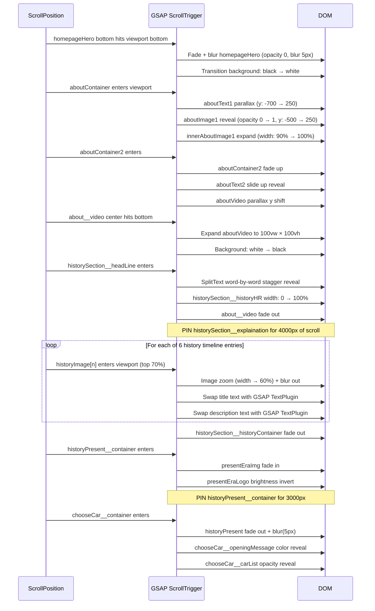

---

## 🖥️ Configurator UI Layer

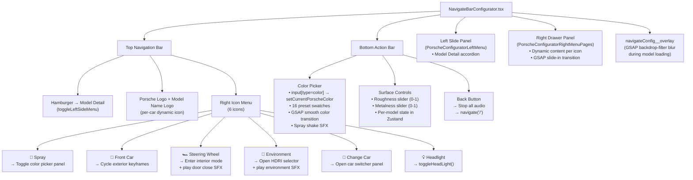

---

## 🌅 HDR Environment System

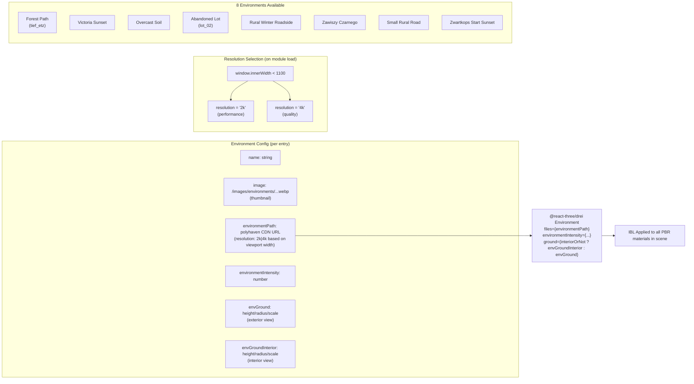

---

## 🚀 Deployment Pipeline

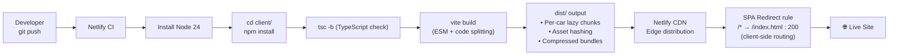

---

## 📁 Project Structure

```
PorscheLab/
├── netlify.toml                    # Netlify build config + SPA redirect
└── client/
    ├── package.json                # Dependencies manifest
    ├── vite.config.ts              # Vite build config
    ├── tsconfig.json               # TypeScript project references
    ├── index.html                  # Entry HTML + meta tags
    └── src/
        ├── main.tsx                # App root: Router + lazy page imports
        ├── index.css               # Global reset + CSS custom properties
        ├── pages/
        │   ├── Homepage.tsx                      # Homepage page + loading screen
        │   ├── PorscheConfigurator.tsx           # Main 3D scene orchestrator
        │   └── ProtectedPorscheConfigurator.tsx  # Route guard wrapper
        ├── Components/
        │   ├── Logics/
        │   │   ├── InitLogic.tsx                 # Homepage GSAP ScrollTrigger orchestrator
        │   │   ├── InitLogicNavConfig.tsx        # Configurator 2D UI entrance animations
        │   │   ├── InitialConfiguratorLogics.tsx # 3D camera cinematic sequence
        │   │   └── HeroContentFrameUpdater.tsx   # Hero frame sync utility
        │   ├── SceneObjects/
        │   │   ├── DynamicCarChanging.tsx         # Lazy model switcher
        │   │   ├── Porsche911GT3RS.tsx             # gltfjsx PBR component (176KB)
        │   │   ├── PorscheSpyder.tsx               # gltfjsx PBR component (196KB)
        │   │   ├── PorscheTaycan.tsx               # gltfjsx PBR component (78KB)
        │   │   ├── PorschePanamera.tsx             # gltfjsx PBR component (96KB)
        │   │   ├── Porsche911TurboS.tsx            # gltfjsx PBR component (44KB)
        │   │   ├── PorscheCayenne.tsx              # gltfjsx PBR component (16KB)
        │   │   ├── PorscheCayman.tsx               # gltfjsx PBR component (14KB)
        │   │   └── Light/
        │   │       └── MemoLighterAccumulativeShadows.tsx
        │   ├── Post-processing/
        │   │   └── EffectComposerHero.tsx          # Bloom + Vignette composer
        │   └── UI/
        │       ├── NavigateBarConfigurator.tsx     # Full configurator UI overlay (497 lines)
        │       ├── NavigateBar.tsx                 # Homepage navigation
        │       ├── HomepageMain.tsx                # Homepage layout root
        │       ├── HomepageContent.tsx             # Hero + sections container
        │       ├── HomepageHistorySection.tsx      # 6-chapter scroll history
        │       ├── HomepagePresentSection.tsx      # Present era pinned section
        │       ├── HomepageLeftMenu.tsx            # Homepage sidebar nav
        │       ├── HomepageFooter.tsx              # Footer component
        │       ├── HomepageVideoClicking.tsx       # Video popup trigger
        │       ├── VideoPopupComponent.tsx         # Modal video player
        │       ├── TransitionToConfigurator.tsx    # Page transition handler
        │       ├── PorscheConfiguratorLeftMenu.tsx # Model detail left panel
        │       ├── PorscheConfiguratorRightMenuPages.tsx # Dynamic right panel
        │       ├── LoadingScreen/
        │       │   └── LoadingHomeScreen.tsx       # WebGL asset load overlay
        │       └── Skeletons/
        ├── stores/
        │   ├── usePorscheConfiguratorSettings.tsx # Primary state store (672 lines)
        │   ├── usePorscheSoundSettings.tsx         # 13-channel audio engine (213 lines)
        │   ├── useSceneSettings.tsx                # Camera + animation flags
        │   └── useCameraControls.tsx               # CameraControls ref store
        ├── styles/
        │   ├── canvas.css
        │   ├── nav.css
        │   ├── loadingScreen.css
        │   ├── fonts/
        │   └── components/ + pages/
        ├── types/
        │   ├── porscheConfigType.ts
        │   └── environemtnConfigType.ts
        ├── utils/
        │   └── gsapColorSmoothChange.ts    # GSAP-driven PBR color transition util
        └── statics/
            └── (static data / constants)
```

---

## 🚀 Getting Started

### Prerequisites

- **Node.js** ≥ 18 (24 recommended, matches Netlify)
- **npm** ≥ 9

### Installation

```bash
# Clone repository
git clone https://github.com/yourusername/PorscheLab.git
cd PorscheLab/client

# Install dependencies
npm install
```

### Development Server

```bash
npm run dev
# → http://localhost:5173
```

### Production Build

```bash
npm run build
# Output: client/dist/
```

### Type Check

```bash
tsc -b --noEmit
```

### Lint

```bash
npm run lint
```

---

## ⚡ Performance Considerations

| Strategy | Implementation |
|---|---|
| **Lazy model loading** | Each of 7 car models is a separate Vite code-split chunk, loaded only when selected |
| **Suspense boundaries** | `null` fallback prevents layout shifts during model swaps |
| **Resolution-adaptive HDR** | 2K HDRIs on viewports < 1100px, 4K on desktop |
| **Bloom at 64×64** | Post-processing resolve at 64px to minimize GPU memory bandwidth |
| **Memoized shadows** | `MemoLighterAccumulativeShadows` wrapped in `React.memo` to prevent re-baking |
| **Audio preload** | All 13 audio tracks preloaded on module evaluation to avoid latency on first trigger |
| **State-gated sounds** | Zustand boolean flags prevent duplicate audio on React StrictMode double-renders |
| **frameloop: always** | Continuous rendering loop for smooth camera interpolation (not demand-based) |
| **CameraControls constraints** | `minDistance`/`maxDistance`/`maxPolarAngle` prevent degenerate camera states |
| **GSAP `overwrite: auto`** | Prevents animation stacking on rapid UI interactions |

---

<div align="center">

**Built with passion for precision engineering and the art of driving.**

*"In the beginning I looked around and, not finding the automobile of my dreams, decided to build it myself."*
— **Ferry Porsche**

</div>

---

<div align="center">

## 🔒 Private Project

**This is a closed, private project.**
The source code is not publicly available and is not open for redistribution, forking, or reuse.

*All rights reserved © 2025 — This repository is for portfolio and showcase purposes only.*

</div>

---

<div align="center">

### Crafted by [R3Vision](https://github.com/ASTRICKK)

**R3Vision** — A creative development studio focused on pushing the boundaries of real-time 3D, interactive web experiences, and immersive digital products.

*From concept to pixel-perfect execution — built with obsession for craft.*

</div>
